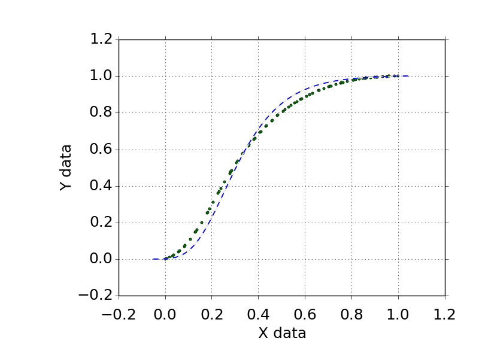
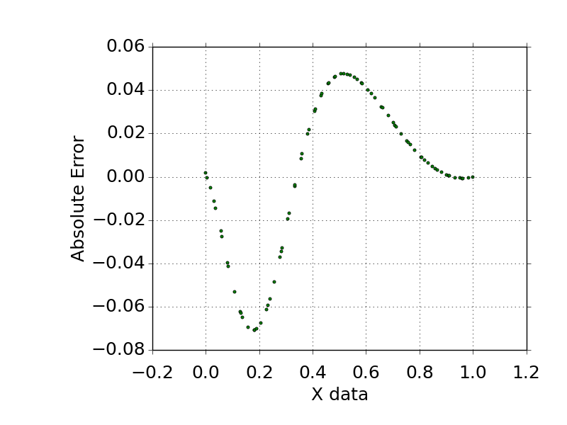

_ease-tween_
============

CSS-style easing and tweening in JavaScript.


Usage
-----

```
$ npm install --save ease-tween
```


### Example

```js
var easeTween = require("easeTween").easeTween;

function easeScrollElementX(element, x, duration, callback) {
  var startX = element.scrollLeft;
  var maxX = element.scrollWidth - element.clientWidth;
  var distanceX = Math.max(0, Math.min(x, maxX)) - startX;
  easeTween(duration, function (t) {
      element.scrollLeft = t * distanceX + startX;
    },
    callback);
}
```

See [_ease-scroll_](https://github.com/mietek/ease-scroll/) for more information.


Documentation
-------------

### easeTween(duration, step, callback)

TODO


### tween(duration, step, callback)

TODO


### ease(t)

An exponential approximation of the default CSS [transition timing function](https://developer.mozilla.org/en-US/docs/Web/CSS/transition-timing-function).





| Absolute error         |                             |
| :----------------------|---------------------------: |
| Minimum                | −7.085130 × 10<sup>−2</sup> |
| Maximum                |  4.759085 × 10<sup>−2</sup> |
| Mean                   |  2.238834 × 10<sup>−4</sup> |
| Standard error of mean |  4.029076 × 10<sup>−3</sup> |
| Median                 |  3.505542 × 10<sup>−3</sup> |
| Variance               |  1.282443 × 10<sup>−3</sup> |
| Standard deviation     |  3.581121 × 10<sup>−2</sup> |
| Skew                   | −5.665190 × 10<sup>−1</sup> |
| Kurtosis               | −7.313037 × 10<sup>−1</sup> |


About
-----

Made by [Miëtek Bak](https://mietek.io/).  Published under the [MIT X11 license](LICENSE.md).


### Acknowledgments

Thanks to [Robert Penner](http://www.robertpenner.com/easing/) for popularising the use of easing functions.

The approximation was found with [ZunZun](http://zunzun.com/Equation/2/Simple/Simple%20Equation%2023/), based on [samples](doc/samples.csv) obtained with [bezier-easing](https://github.com/gre/bezier-easing).
